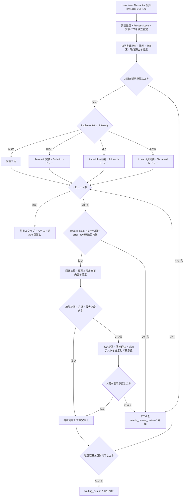
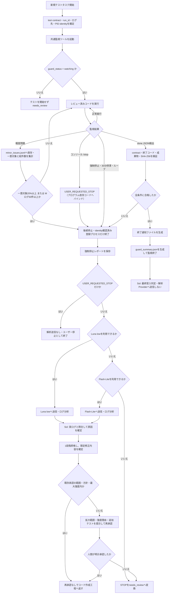

<!-- md-scope-document: COMMON -->
# GENERAL: コーディング・テスト共通方針

## Tusk Core boundary

Core is domain-neutral. Product, adapter, and legacy project contracts must be
kept outside Core runtime and schemas. New guard logs use `TUSK_*` markers;
legacy markers are compatibility input only. Normal Focus Cache operations must
bind an explicit workspace and may write only below its `work/focus_cache/`.

個別仕様と`AGENTS.md`を優先する。この文書は今後作る制作物の共通実装・テスト規則とする。

担当権限、提案権限、自己承認禁止は`AUTHORITY_SEPARATION.md`を正本とする。実装経路は`ROUTING_POLICY.md`、安全工程は`PROCESS_POLICY.md`を正本とする。
SHA-256の適用範囲と開発キーは`INTEGRITY_POLICY.md`を正本とする。SHAは配布物の同一性確認に限定し、信頼済み開発キーのscope内では不一致を警告扱いにできる。

## Single Authority Principle

- 1つの規範的概念には正本を1つだけ持つ。他文書は意味、表、状態、番号帯を再定義・再掲せず、正本を参照する。
- 機械判定可能な定義、対応表、registryはJSON、YAML、Toolを正本とし、Markdownへ複製しない。
- 現行の概念と正本の対応は`AUTHORITY-MAP.json`を機械的正本とする。Markdown上の説明よりmapを優先する。
- 新規Markdown作成は例外とする。既存Authorityで扱える場合は既存正本へ追加し、独立した規範的概念である場合だけCreation Gate通過後に新規Authorityを作る。
- 新規Authority追加時、CoreまたはExtensionの大規模仕様変更後、release前、文書数閾値超過時だけ読み取り専用Authority監査を行う。毎タスクでは実行しない。
- 監査担当は重複・矛盾候補だけをJSONで報告し、設計変更、統合、削除、正本化を行わない。監査レポートは一時証拠であり、規範的正本にしない。
- 監査分類は`DUPLICATE_AUTHORITY`、`DUPLICATE_DEFINITION`、`CONTRACT_CONFLICT`、`STALE_RULE`、`STALE_REFERENCE`、`ORPHAN_SPEC`、`OVERLAPPING_SCOPE`、`MACHINE_RULE_IN_MARKDOWN`、`UNNECESSARY_DOCUMENT`とする。

## 開発指揮と会話

- コーディングは、開発指揮がサブエージェントへ限定タスクを渡す形式で行う。
- 開発指揮と流し見担当の低推論モデルは、作業前に現行の設計図を確認する。
- 制作中の会話へ思考履歴や長いログを出力しない。根拠はログ、差分、JSON、仕様書へ保存する。
- 会話返答は最低限の結果、判定、次の行動だけとする。
- コード内コメントは原則として追加しない。

## Implementation IntensityとProcess Level

経路分類は`ROUTING_POLICY.md`、Process Level・機械補正・Protected Surface・軽量ルートは`PROCESS_POLICY.md`を正本とする。作業開始時は`Luna/low`が設計図、キャッシュ、対象差分を読み取り専用で流し見し、実装難易度`implementation_intensity`と影響・安全工程`process_level`を独立判定する。`Luna/low`が利用できない場合だけ`Antigravity Flash-Lite`へ切り替える。両方とも編集、テスト、再起動、停止操作を行わない。

流し見結果は最低限、`implementation_intensity`、`process_level`、`affected_paths`、`risk_triggers`、`required_tests`、`snapshot_policy`、`confidence`、`needs_review`を返す。根拠不足、`confidence < 0.8`、計画外パスへの拡大は`needs_review`とし、二軸を再判定する。一方の上昇から他方を自動推定しない。

| Implementation Intensity | 実装・レビュー |
|---|---|
| `MAX` | 例外的な最高能力実装・集中レビュー |
| `HIGH` | `Terra/mid`実装、`Sol/mid`レビュー |
| `MID` | `Luna/Ultra`実装、`Sol/low`レビュー |
| `LOW` | `Luna/high`実装、`Terra/mid`レビュー |

`Luna/high`と`Luna/Ultra`は、開発指揮が指定した変更可能パスだけ編集できる。実装用Lunaが利用できない場合は`Terra/mid`へ切り替える。Provider確認は作業単位で1回とし、接続失敗を反復しない。Provider変更は再作業回数へ含めない。

通常は`LOW`、`MID`、`HIGH`だけを使う。`MAX`は再発するエラー・停止、または`Terra/mid`では信頼できる実装が困難だと根拠付きで判定した場合だけ、作業単位で1回だけ自動適用できる。`MAX`適用後の追加修正・再実装は、ソース編集やテスト前に`needs_human_review`へ停止し、人間の明示承認を得る。Process Levelだけを理由に`MAX`へ上げない。

安全工程とテスト下限は`process_level:P0`〜`process_level:P4`から決める。外部アプリ操作は最低`process_level:P3`、配布・Installer・破壊的操作は`process_level:P4`とする。

## 再作業上限

- `MAX_REWORK_COUNT = 3`とする。初回実装と初回テストは数えない。
- 初回計画の承認には、承認範囲・修正方針・再作業最大強度内で行う最大3世代の限定修正を含める。この3世代は追加承認なしで自動進行できる。
- `rework_count`は限定修正へ着手する時点で1加算する。同じ修正世代に対するレビューとテストを別々に加算しない。修正を行わず再確認しただけの場合も加算しない。
- 異なる`error_key`への修正でも総修正世代には加算する。
- 連続失敗の同一性は、`error_key + 対象仕様 + 対象ファイル + 失敗工程`の組で判定する。名称だけを変更して別事案として扱わない。
- 同じ組が限定修正後も再発した場合に連続回数を加算し、2回連続した時点で上限前でも`waiting_human`へ停止する。
- 修正効果が機械的な検証で確認できた場合だけ、その組の連続回数を解除する。ログ文言の変化や一時的な非再現だけでは解除しない。
- CLI送信障害、テストコード不備、テスト環境障害、Provider障害は、製品コードの連続失敗回数へ算入せず、別の`error_key`と失敗区分で記録する。
- テスト対象とテストコードが一行も実行される前に、コマンドのパス、引用符、モジュール指定だけが原因で失敗した場合は`preflight_error`とする。訂正前後のコマンドとエラーを保存し、コマンド文字列だけを機械的に訂正して1回だけ再起動できる。
- `preflight_error`の訂正で、製品ソース、テストコード、fixture、期待値、環境設定、依存物を変更してはならない。2回目も起動不能なら`waiting_human`へ停止する。
- ファイル不存在、正本不明、workspace外参照、権限エラー、reparse point、対象SHA不一致、または製品・テストコードが一行でも実行された可能性がある場合は`preflight_error`へ分類せず、初回から通常の停止規則を適用する。
- `waiting_human`から同じ作業IDで再開した場合は連続回数を維持する。新しい作業IDでも未解決事案を引き継ぐ場合は維持する。
- 同一失敗が2回連続した場合はフォーカスキャッシュの優先度を上げ、発生回数、直近2世代の対策、改善しなかった根拠を保存する。
- 上限到達後は新規修正、再テスト、追加エージェント起動を禁止し、`needs_human_review`へ移す。
- 限定修正の実行中に`STOP`、非ゼロ終了、計画外依存、編集不能が発生した場合は、自動で別案、別担当、再実行へ進まず`waiting_human`へ移す。ただし上記`preflight_error`の訂正1回だけを例外とする。停止時点の修正世代は消費済みとして保持する。
- `waiting_human`中は差分と一時成果物を保持し、人間が明示的に再開、修正案変更、破棄のいずれかを指示するまで作業しない。
- 停止時は差分、SHA-256、失敗テスト、エラーコード、ログ末尾、フォーカスキャッシュを保存する。
- 新しい作業IDで、未解決の`error_key`、対象仕様、対象ファイル、失敗工程を引き継がない場合だけ`rework_count`と連続失敗回数をリセットできる。いずれかの未解決事案を引き継ぐ場合は、人間が再開を指示してもカウンタを維持する。

### `waiting_human`再開規則

- `waiting_human`からの操作は`resume`、`revise`、`rollback`、`abandon`の4種類だけとする。
- `resume`: 現在の承認契約、差分、修正案、`rework_count`、連続失敗回数を維持して再開する。
- `revise`: 人間が修正方針を変更する。変更後の範囲、禁止範囲、強度、必須テストを提示し、承認契約を更新してから再開する。
- `rollback`: 今回の作業IDで生成した修正差分だけを対象として戻す。既存のユーザー変更、失敗証拠、ログ、フォーカスキャッシュを戻さない。
- `abandon`: 実装未完了として終了する。差分、ログ、失敗証拠、キャッシュ、引き継ぎ状態を保存し、完成または成功として扱わない。
- 全操作は対象`work_id`の明示を必須とする。ただし「続行」等の曖昧な指示は、直前に停止した未完了作業が一件だけであり、対象を機械的に一意特定できる場合に限り、その作業への`resume`として扱える。
- 再開前に、停止時に保存した仕様SHA、対象ファイルSHA、差分SHAと現在値を照合する。一件でも不一致なら再開せず`waiting_human`とし、外部変更として再承認を要求する。
- `resume`では`rework_count`と連続失敗回数をリセットしない。
- `revise`で変更範囲、修正方針、または再作業最大強度を超える場合は、通常の再承認契約を適用する。
- `rollback`は対象差分と対象パスを事前提示し、人間の明示承認後だけ実行する。対象を一意に分離できない場合は実行せず`needs_human_review`を維持する。
- `abandon`後の再開は新しい作業IDを使う。ただし未解決の同一失敗を引き継ぐ場合、連続失敗回数とフォーカスキャッシュは維持する。

### 作業状態と停止優先順位

- 作業状態は`running`、`needs_review`、`waiting_human`、`needs_human_review`、`completed`、`abandoned`の6種類だけとする。
- `current_state`は常に1つだけ保持する。複数状態の併記、成功状態と停止状態の同時保持、状態フィールドの省略を禁止する。
- `running`: ユーザー指示と現行仕様の範囲内で自動処理を継続できる。
- `needs_review`: 技術情報またはレビュー根拠が不足し、指定された読み取り専用レビュー担当の確認を待つ。
- `waiting_human`: 人間の操作、判断、再開指示を待つ。自動処理を禁止する。
- `needs_human_review`: 再作業上限到達、承認範囲超過、または`MAX`適用後の追加修正など、人間の再判定を必須とする。
- `completed`: 全成功条件、成果物検証、必須テスト、最終レビューを通過した状態とする。
- `abandoned`: 未完了のまま作業を終了し、引き継ぎ証拠を保存した状態とする。
- 同一イベント処理中に複数の遷移条件を検出した場合の選択順は`abandoned > needs_human_review > waiting_human > needs_review > running > completed`とする。選択後は1状態だけを`current_state`へ保存し、他の候補は遷移理由へ記録する。
- `completed`後に未解決エラー、未検証条件、承認範囲外差分を検出した場合は完成判定を取り消し、該当する停止状態へ移す。
- `waiting_human`、`needs_human_review`、`abandoned`中は、編集、テスト、再実行、ビルド、追加エージェント起動を禁止する。
- `needs_review`中は製品コード編集、実行テスト、再実行、ビルドを禁止する。指定された読み取り専用レビュー担当だけを起動でき、仕様、差分、ログ、SHA-256の確認だけを許可する。
- `needs_review`のレビュー担当は状態を直接解除せず、確認範囲、根拠、判定、未解決事項を開発指揮へ返す。開発指揮が現行仕様と照合して状態を変更する。
- 読み取り専用レビューで技術情報が充足し、承認契約内で作業可能と確認できた場合は`running`へ戻す。人間の判断または操作が必要なら`waiting_human`、再作業上限または承認範囲超過なら`needs_human_review`へ移す。
- 指定Providerのレビュー担当が利用できない場合、Provider再接続を反復せず、開発指揮自身による読み取り専用レビューへ一度だけ切り替えられる。開発指揮も根拠を確定できない場合は`waiting_human`へ移す。
- `needs_review`を解除できるのは、読み取り専用レビュー結果を現行仕様と照合した開発指揮、または人間だけとする。実装担当、監視ツール、解析Providerは解除できない。
- 状態変更時は`work_id`、変更前状態、変更後状態、理由、UTC時刻、仕様SHA、対象差分SHAを保存する。
- 状態変更は追記専用の`state_transition`履歴として保存し、過去状態を上書き・削除しない。状態遷移と成功通知が競合した場合は、停止遷移を確定して成功通知を生成しない。
- 自動処理、監視ツール、実装担当、レビュー担当は停止状態を独自に解除しない。解除は規定されたレビュー完了または人間の明示指示だけで行う。

### `STOP`の状態変換

- `STOP`は作業状態ではなく、後続処理を即時止めて理由別状態へ変換する制御シグナルとする。`STOP`文字列だけを最終状態として保存しない。
- 明示承認なし、修正処理の非ゼロ終了、編集不能、人間の操作待ちは`waiting_human`へ変換する。
- 再作業上限到達、危険領域への範囲拡大、または`MAX`適用後の追加修正は`needs_human_review`へ変換する。
- 技術情報不足、レビュー根拠不足、解析Provider不在で読み取り専用確認が必要な場合は`needs_review`へ変換する。
- 人間が終了または破棄を明示した場合は`abandoned`へ変換する。
- 変換不能な`STOP`は推測で分類せず`waiting_human`へ変換し、未分類理由を記録する。

### 修正世代SHA契約

- 初回承認時の対象ファイルSHAを`approval_base_sha`として不変保存する。
- 各限定修正へ着手する直前に、対象ファイルごとの現在SHAと差分SHAを`generation_base_sha`として保存する。
- 実装担当は`generation_base_sha`一致を編集直前に再確認する。不一致なら編集せず`STOP`を返し、外部変更として`waiting_human`へ移す。
- 限定修正が正常完了した時だけ、変更後SHAと実差分SHAを`generation_result_sha`へ保存する。次の修正世代は直前の`generation_result_sha`を基準とする。
- レビュー、テスト、再確認だけでは修正世代を進めず、`generation_base_sha`を更新しない。
- 各世代は`work_id`、`generation`、`rework_count`、対象パス、base/result/diff SHA、`error_key`、実装結果を持つ。欠落時は次世代へ進まない。

## 承認と修正ループ

- 通常の`LOW`、`MID`、`HIGH`作業は途中承認を要求せず、ユーザーの作業指示を開始許可として実装、レビュー、監視テスト、上限内の限定修正まで進める。
- 人間の明示承認が必要なのは、`MAX`、破壊操作、workspace外変更、配布・Installer、認証・秘密情報、利用者データ、またはGitで安全に分離できない非常時rollbackだけとする。
- 通常のレビュー不合格とテスト不合格は承認待ちにせず、`MAX_REWORK_COUNT`内で原因特定、限定修正、再テストへ進む。
- 同じ失敗が2回連続するか再作業上限へ達した場合は後続を止め、Focus Cacheへ地雷と発生回数を保存して`waiting_human`へ移す。
- テスト合格時は追加承認、追加解析エージェント、Focus Cache更新を行わず、成果物検証後に完了とする。
- 計画外の変更が危険領域へ広がらず、指定workspace内かつGit差分で分離可能なら、変更範囲とテストを更新して通常ループを継続できる。危険領域へ入る場合だけ承認を得る。
- 非常時rollbackは、作業専用branchまたはworktree、開始commit、clean baseline、今回差分の分離を確認できる場合だけ行う。条件を満たさない場合は差分を保持して`waiting_human`へ移す。
- リポジトリ全体への`git reset --hard`は禁止する。失敗branchを正本へmergeしない運用を優先する。

## コード作成工程



## テスト・監視工程



## 担当境界

- Sol: 仕様作成、変更許可、`MAX/HIGH/MID`のレビュー、原因確定、修正指示、完了判定。
- Terra medium: `HIGH`の実装、`LOW`のレビュー、Luna実装Provider不在時の代替を担当する。
- Luna low: 流し見と失敗ログ分析だけを行う。コード変更、テスト実行、再起動、停止操作は禁止。
- Luna high: `LOW`の限定実装を担当する。
- Luna Ultra: `MID`の限定実装を担当する。
- Antigravity Flash-Lite: Luna low不在時の流し見・失敗ログ分析だけを担当し、コードを変更しない。
- Luna mid: `HIGH/MAX`の担当交代時だけ、選択済み一時スナップショットを引継ぎカプセルへ圧縮する。新しい原因、修正案、成功判定を追加しない。
- 共通監視ツール: 機械的な監視、記録、許可済みプロセスの停止だけを行う。原因確定はしない。

実装担当は原則1エージェントとする。並列化を予定または推奨する場合は、対象、理由、担当境界、依存関係、競合防止策を先に提示し、人間の明示承認後だけ実行する。未承認時は完全直列とする。並列化は承認後も依存しない別ファイル群または独立成果物に限定する。同じファイルの二段階編集は既定にせず、レビューで問題が見つかった場合だけ限定修正する。

全実装担当は、開発指揮から渡された実装計画だけを作業判断の根拠とする。会話履歴や実装計画にない仕様、ログ、キャッシュ、他ファイルを独自に探索しない。参照できるソースと編集できるソースは、実装計画の許可リストへ分けて明記する。

## 実装担当へ渡す実装指示

次の全項目を埋める。欠落項目がある場合は実装せず`needs_review`を返す。

```text
対象仕様:
対象仕様SHA-256:
対象機能:
参照可能パス:
変更可能パス:
変更禁止パス:
対象ファイル変更前SHA-256:
approval_base_sha:
generation:
generation_base_sha:
参照する設計図:
選択する変数バインド:
現在の失敗または要求:
実装要求:
implementation_intensity:
再作業最大強度:
intensity_reason:
process_level:P0
process_level_reason:
rework_count:
例外承認ID（必要時だけ）:
強制停止コード:
軽度問題コード:
成功条件:
テスト工程への引渡し条件:
```

実装担当の返答は次に限定する。

```text
変更ファイル:
実装内容:
構文・静的確認:
未解決事項:
```

## コード生成規則

1. 指定範囲外のファイル、ID、件数、順序、原文を変更しない。
2. 既存ログ、入力、失敗成果物を削除・上書きしない。
3. 実装担当は、実装計画に記載された参照可能パスだけを読み、変更可能パスだけを編集する。
4. 実装計画にないファイルや情報が必要になった場合は作業を止め、追加参照または追加変更を提案して承認を待つ。
4.1. 計画外変更の再承認要求には、拡大後の範囲、追加修正、Implementation IntensityとProcess Level、その判定理由、追加テストを必ず含める。
5. 修正前に開発指揮が用意したキャッシュと現在差分を読み、ファイル全体の書換えを避ける。
6. 変数は承認済み設計図の選択肢からバインドし、任意値を新設しない。
7. 選択肢外の変数・値・接続が必要な場合は、危険領域へ入る時だけ人間の承認を得る。通常領域は開発指揮が計画へ追加する。
8. 実装は1エージェントを既定とする。並列化候補は対象、理由、担当境界、依存関係、競合防止策を提示し、人間の明示承認後だけ開始する。未承認時は完全直列とする。
9. 同一ワークツリーの同一ファイルを複数エージェントが同時編集しない。
10. 同じファイルの再編集はレビューで問題が確認された場合だけ行い、差分固定後に限定修正する。
11. 子プロセスは監視へ渡せるルートPIDの子として起動し、PIDとコマンドをログへ残す。
12. 例外を握りつぶさない。継続不能なら強制停止、継続可能なら軽度問題へ分類する。
13. 自動再起動、無制限再試行、成功条件の緩和を実装しない。
14. 実装担当は構文・静的確認まで行い、実行テストは監視スクリプトへ渡す。テスト実行専用エージェントは配置しない。
15. 対象仕様SHAまたは開始時対象SHAが一致しない場合は編集せず、外部変更として再調査する。
16. 計画外変更が危険領域へ入る場合だけ作業を止め、人間の明示承認を得る。通常領域内の限定修正は差分とテスト範囲を更新して継続できる。

## 作業単位フォーカスキャッシュ

コンテキストキャッシュ利用前に`CONTEXT_CACHE_SPEC.md`、失敗修正時は`FOCUS_CACHE_SPEC.md`を読む。Focus Cacheは`LANDMINES.md`だけを正本とする。

### 2種類のキャッシュ

- 新規制作はコンテキストキャッシュを使い、対象scope全体、依存関係、仕様、差分、整合性を確認する。フォーカスキャッシュを既定入力にしない。
- 修正は対象と一致する地雷だけを確認する。
- 修正時のコンテキストキャッシュは、現在パス、仕様SHA、対象ファイルSHAの確認だけに限定する。
- 新規制作中に失敗が発生した場合は、原因調査後に地雷として登録できる。
- フォーカスキャッシュは自動修正命令、テスト成功証拠、完成判定に使用しない。
- 同じ`error_key`は発生回数を加算し、別記録へ分割しない。
- 成功時はFocus Cacheを更新しない。
- revision、reservation、promotion、transient、handoff、extension共有は新規運用で使用しない。

### ログ保持

- 成功時はstdout・stderr全文を恒久ログ庫へ保存せず、run ID、仕様ID、終了コード、成功件数、ID照合、成果物SHA、開始・終了時刻、最終レビューを`success_summary.json`へ残す。既存ログは削除しない。
- 失敗時は`error_excerpt`、発生理由、発生箇所、根拠、回避規則、適用した対策、変更前後SHA、検証結果、フォーカスキャッシュ参照を失敗教材として保存する。
- 失敗は`LANDMINES.md`へ地雷、原因、正解パターン、発生回数として保存する。
- 保存する理由は検証可能な判断根拠に限定し、逐語的な内部推論を保存しない。

## テスト実行規則

テスト選択の正本は`TEST_POLICY.md`とする。修正サイクル中は個別テストだけを反復し、一連の変更が終わった時にコンポーネントテスト、統合・配布前に全体テストを行う。

1. コードレビュー完了後の引渡し物だけをテストする。
2. `TEST-MAP.json`の`変更ファイル -> 個別テスト`対応から差分に関係するテストだけを選ぶ。対応がない変更は自動的にコンポーネントテストへ昇格する。
3. テスト下限はImplementation Intensityではなく`PROCESS_POLICY.md`の`process_level:P0`〜`process_level:P4`から決める。
4. 個別テスト合格は修正単位の合格に限定する。一連の修正完了時はコンポーネントテスト、リリース、インストーラ、統合版保存前は`process_level:P4`として全体テストを行う。
5. テスト中はコードを変更しない。
6. 実行ごとに新しい`run_id`と専用ログフォルダを作る。
7. 実行中はコマンド、stdout、stderr、開始・終了時刻、終了コード、入力、成果物パスを一時保存する。成功確定後は`success_summary.json`だけを恒久保存対象とする。
8. 非ゼロ終了または監視エラーを検知した時点で後続テストを止める。ただしテスト開始前の`preflight_error`は、限定訂正1回に限り同じテストを起動できる。
9. 終了コード0、ファイル生成、ログ生成だけで成功判定しない。
10. 終了通知ファイルは、仕様の成功条件と成果物検証が全て通った後だけ生成する。
11. 強制停止と終了通知が同時に存在する場合は強制停止を優先する。
12. 失敗後は監視ツールが後続テストを止め、構造化ログを解析担当へ渡す。原因確定後は`MAX_REWORK_COUNT`内で限定修正と再テストを行い、上限到達時だけ地雷を保存して`waiting_human`へ移す。
13. 個別処理のハードタイムアウトは現時点で設けず、全体の30分停滞監視を維持する。実害が確認された処理だけ個別Specで追加する。

## CLI送信とLuna low

テスト成功時はLunaまたはAntigravityへ何も送信しない。テスト失敗・障害起因の強制停止時だけ解析用プロンプトを送信する。軽度問題だけ、または各プログラムがバインドした`USER_REQUESTED_STOP`だけでは送信しない。

```text
codex exec -s read-only resume -m gpt-5.6-luna -c model_reasoning_effort="low" -o luna_response.md <session_id> -
```

- テスト失敗後にLuna Task Providerの利用可否を確認する。成功時はProviderを起動しない。
- Luna lowを利用できない場合はAntigravity Flash-Liteへ同じ読み取り専用解析指示を送る。
- 両Providerを利用できない場合は送信を反復せず`needs_review`とする。
- 新規解析タスクを既定とする。
- 既存タスクはUI上で`/clear`完了を確認できた場合だけ使用する。通常メッセージとして送った`/clear`は消去証拠にしない。
- 同一テストタスク中は履歴を維持する。
- 入力は`force_stop_report.json`、`luna_report_prompt.md`、対象ログ末尾に限定する。
- Lunaはエラーコード、停止地点、対象PID、直接原因候補、根拠、修正候補を返す。
- Lunaの分析だけで修正を開始しない。Solが実ログと照合してからTerraへ指示する。
- CLI送信失敗時は`codex_cli_notify.json`を残し、Solが保存済みファイルを直接読む。

## 完了条件

- 個別仕様の全成功条件と必須テストを満たす。
- 最新実行の件数、ID集合、更新時刻、SHA-256、成果物を確認する。
- 強制停止が存在しない。
- 軽度問題が許容範囲かSolが確認済みである。
- Solのコードレビューと最終判定が完了している。

`guard_summary.json`の`completed`だけでは制作物の完了を意味しない。

参照: `CONTEXT_CACHE_SPEC.md`、`FOCUS_CACHE_SPEC.md`
