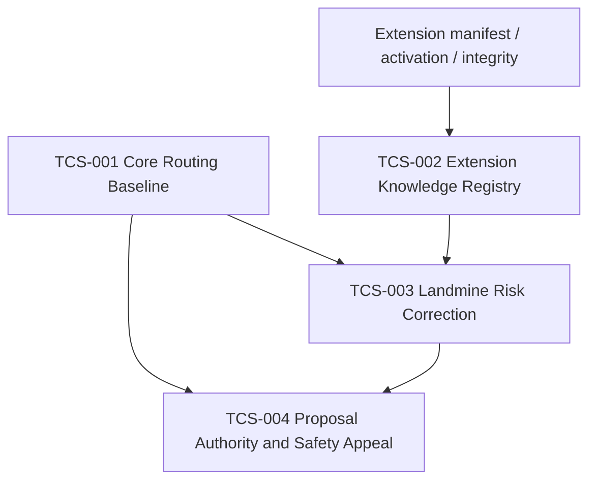

<!-- md-scope-document: COMMON -->
# Tusk Core改善Spec設計図

## 状態

- `SUPERSEDED_BY_TCS-001..004`
- 本文はSpec分割前の設計図であり、既存契約を上書きしない。
- IdTask固有機能は対象外。

## 情報源

- 共有会話: `https://chatgpt.com/share/6a80c392-8284-83e8-83c2-18e7dc57dd0b`
- 現行正本: `GENERAL.md`、`IMPLEMENTATION_INTENSITY.md`、`PROCESS_LEVELS.md`、`PROCESS_LEVEL_CORRECTIONS.md`、`LIGHTWEIGHT_ROUTE.md`、`PROTECTED_SURFACES.md`、`SKIM_DECISION.md`、`FOCUS_CACHE_SPEC.md`、`AUTHORITY_SEPARATION.md`

## 改善案13件の棚卸し

| No. | 改善案 | 現状 | Spec上の扱い |
|---:|---|---|---|
| 1 | Implementation Intensity / Process Levelの二軸化 | 実装済み | 基準Specへ登録し回帰だけ行う |
| 2 | 流し見役の二軸判定 | 実装済み | 基準Specへ登録し回帰だけ行う |
| 3 | Process Level P0-P4 | 実装済み | 基準Specへ登録し回帰だけ行う |
| 4 | 低リスク軽量ルート | 実装済み | 基準Specへ登録し回帰だけ行う |
| 5 | Protected Surface | 実装済み | 基準Specへ登録し回帰だけ行う |
| 6 | Process Levelの機械補正 | 実装済み | 基準Specへ登録し回帰だけ行う |
| 7 | Extension単位Shared Focus | 現行Focus方針と衝突 | Focusへ戻さず、任意のExtension Knowledgeとして再設計 |
| 8 | Focus Knowledge Promotion | 現行Focusでは廃止済み | Landmineから自動昇格させず、独立した知識候補の明示承認方式へ変更 |
| 9 | Shared知識の適用範囲・寿命 | 未実装 | Extension Knowledge採用時の必須契約に統合 |
| 10 | Focusを強度決定主体にしない | 原則実装済み | Landmineは下限補正の証拠に限定し、強度低下を禁止 |
| 11 | Risk評価軸の拡張 | 未実装 | 固定スコアではなく構造化した補正根拠として設計 |
| 12 | Execution Authority / Proposal Authority分離 | 部分実装 | `AUTHORITY_SEPARATION.md`の追加契約として新規Spec化 |
| 13 | 安全レベルへの異議・昇格提案 | 部分実装 | 提案と適用を分離し、低下は人間承認必須として新規Spec化 |

## 設計原則

1. Work Packetは復活させない。Git差分、対象Spec、テスト結果を作業境界とする。
2. Focus Cacheは`LANDMINES.md`だけを正本とし、失敗回数、原因、正解パターン以外を持たせない。
3. プロジェクト間で共有する知識はFocus Cacheから分離する。
4. 知識は権限を与えない。実装強度やProcess Levelを下げる根拠にしない。
5. 機械補正はProcess Levelの下限だけを上げられる。下げる操作は提案に留める。
6. 通常作業へ新しい承認階層を追加しない。
7. テストはスクリプト主体とし、成功時に解析エージェントを起動しない。

## Spec分割

### TCS-001 Core Routing Baseline

対象: 改善案1〜6。

目的: 実装済み契約を1つの受入Specから参照し、二軸判定、流し見、軽量ルート、Protected Surface、機械補正の整合性を固定する。

変更方針:

- 各正本Markdownの責務を変更しない。
- 重複規則を新Specへコピーせず、正本パスと必須出力だけを参照する。
- 既存契約テストを受入マトリクスへ束ねる。

成功条件:

- `LOW/P4`と`MAX/P0`を独立に表現できる。
- Protected Surfaceと機械補正がProcess Levelを下げない。
- Lightweight Routeが`P2+`、Protected Surface、失敗後に発火しない。
- 流し見担当が編集、テスト、承認、完了判定を行わない。

### TCS-002 Extension Knowledge Registry

対象: 改善案7〜9。

目的: Extension固有の再利用知識をFocus Cacheへ混ぜずに保管する。

保存候補:

```text
extensions/Tusk_<id>/knowledge/
├ registry.json
├ patterns/
└ frequent_errors/
```

必須フィールド:

```yaml
knowledge_id:
extension_id:
kind: pattern | frequent_error
source_project:
source_evidence:
applicability:
  platform:
  runtime:
  dependencies:
  version_ranges:
verified_at:
state: candidate | verified | stale | needs_review | retired
reviewed_by:
```

境界:

- Project Landmineを自動昇格しない。
- `candidate -> verified`は独立レビューと証拠を必要とする。
- Extensionが無効なら読まない。
- Core、他Extension、Project Focusを上書きしない。
- dependencyまたはmanifest bindingが変わった場合は`stale`へ落とす。
- この機能を採用しない場合、TCS-002全体を`FROZEN`にできる。

成功条件:

- Focus Cacheの単純な正本形式を一切変更しない。
- 未検証知識が実装、スキップ、完了判定へ使用されない。
- 無効Extensionの知識が選択されない。
- 同じ知識IDの競合を自動マージしない。

### TCS-003 Landmine Risk Correction

対象: 改善案10〜11。

目的: Landmineを強度決定主体にせず、再発危険の下限補正証拠として扱う。

入力候補:

```yaml
landmine_match:
  error_key:
  target_match:
  occurrence_count:
  cause_confirmed:
  correct_pattern_present:
risk_evidence:
  failure_frequency:
  ambiguity:
  blast_radius:
  dependency_volatility:
  rollback_difficulty:
```

補正規則:

- 一致しないLandmineは補正へ使わない。
- 原因未確定、対象不一致、古い正解パターンは`needs_review`とする。
- LandmineはLightweight Routeを禁止するかProcess Level下限を上げられる。
- Implementation IntensityまたはProcess Levelを下げてはならない。
- 単一の加点合計だけで危険度を決めず、発火した根拠を列挙する。

成功条件:

- CUDA未導入など単一環境原因の反復を、無関係な実装難易度へ誤変換しない。
- 同一エラー2回の停止規則と矛盾しない。
- 成功ログや推論履歴をFocusへ追加しない。

### TCS-004 Proposal Authority and Safety Appeal

対象: 改善案12〜13。

目的: 規則内の実行権限と、規則改善・安全レベル変更を提案する権限を分離する。

権限:

```text
Execution Authority
= 有効な契約内で実行する権限

Proposal Authority
= 契約、Process Level、Protected Surface、テスト範囲の変更案を提出する権限
```

規則:

- Proposal Authorityは編集、実行、承認、状態解除を許可しない。
- Process Levelの昇格提案は根拠を添えて開発指揮が採用できる。
- Process Level低下提案は、人間の明示承認なしに適用しない。
- Protected Surface、P4強制条件、個別Specの下限は異議申立てで迂回できない。
- 提案却下は実装失敗やrework countへ算入しない。

成功条件:

- 「提案できる」と「適用できる」が機械的に区別される。
- 通常のLOW/MID/HIGH作業へ承認待ちを追加しない。
- 安全レベル低下が自動適用されない。

## 依存関係



## 推奨実装順

1. `TCS-001`で現行1〜6の受入基準を固定する。
2. `TCS-004`で提案権限を先に分離する。
3. `TCS-003`で単純なLandmine下限補正だけを追加する。
4. `TCS-002`は共有知識が実際に必要になった時だけ実装する。

## 非採用

- Work Packetの再導入
- Focus Cacheの旧JSON/Schema/promotion/handoff復活
- 成功ログのFocus保存
- 知識一致によるテスト省略
- AIの自己承認
- 推論スコアだけによるProcess Level低下

## Spec作成前の決定事項

## 正式化結果（2026-08-17）

- 改善案1〜6: `TCS-001 COMPLETED`
- 改善案7〜9: `TCS-002 FROZEN`
- 改善案10: 解決済みとして凍結
- 改善案11: `TCS-003 COMPLETED`
- 改善案12〜13: `TCS-004 COMPLETED`

1. TCS番号体系をCore独立の正式番号として採用するか。
2. TCS-002を現フェーズで実装するか、`FROZEN`にするか。
3. Extension Knowledgeの書込主体を人間、開発指揮、専用CLIのどれに限定するか。
4. Landmine一致時の既定動作を「Lightweight禁止」だけにするか、「最低P2」まで上げるか。
